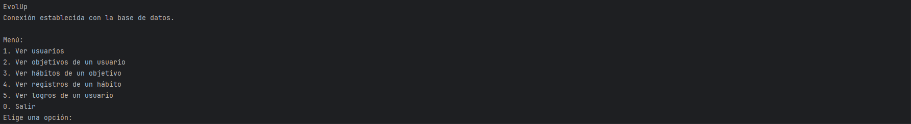
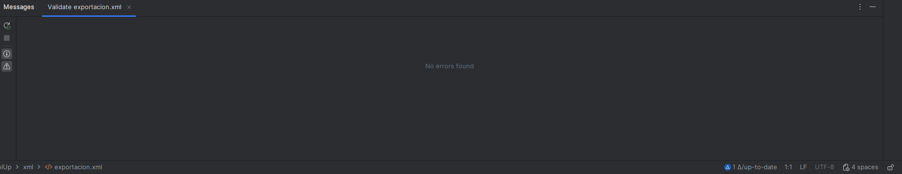

# Portfolio

## EvolUp — Gestor de objetivos y hábitos

**Repositorio:** [github.com/tordan21/EvolUp](https://github.com/tordan21/EvolUp)

### ¿Qué es?

Aplicación de escritorio en Java que permite gestionar objetivos personales, asociarles hábitos y registrar el cumplimiento día a día.

### Capturas

**Menú principal de la aplicación:**

**Validación XML en IntelliJ IDEA:**

### Tecnologías

Java 17 · MySQL 8.0 · JDBC · Maven · XML/XSD · Git

### Lo que he aprendido

- Diseñar una base de datos relacional y escribir consultas SQL reales
- Conectar Java con MySQL mediante JDBC usando el patrón DAO
- Organizar el código en capas para que sea más fácil de entender
- Llevar el control del proyecto con Git desde el principio, no sólo al final
- Crear y validar archivos XML con un esquema XSD
