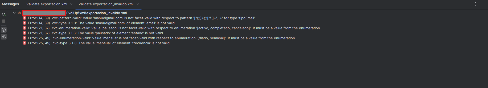

# Informe Técnico de Entorno de Ejecución — EvolUp

## 1. Tipo de sistema

EvolUp es una aplicación de escritorio pensada para uso personal. El usuario la instala y ejecuta en su propio PC, igual que cualquier otro programa de escritorio.

No necesita servidor, ni máquina virtual, ni conexión a Internet. La base de datos es local (MySQL corriendo en el mismo equipo), así que todo funciona en una sola máquina.

Se ha elegido este modelo porque la aplicación gestiona objetivos y hábitos personales: los datos son del usuario, los usa sólo él, y no tiene sentido montarlo en infraestructura compartida para un uso así.

---

## 2. Requisitos de hardware

| Componente | Mínimo | Recomendado |
|---|---|---|
| CPU | 64 bits, 1 núcleo, 1 GHz | Intel Core i3 / AMD Ryzen 3 o superior |
| RAM | 512 MB | 2 GB |
| Almacenamiento | 1 GB libres | 2 GB libres |
| Pantalla | Cualquiera con soporte de terminal | — |

**Justificación:**
- La JVM de Java necesita unos 256 MB sólo para arrancar; con MySQL activo se llega fácilmente a 400-500 MB de uso real.
- El almacenamiento cubre el JDK (~180 MB), MySQL (~400 MB) y el proyecto con sus dependencias Maven (~200 MB).
- No se requiere tarjeta gráfica ni periféricos especiales porque la interfaz es de consola.

---

## 3. Sistema operativo

**Sistema recomendado: Windows 10 / Windows 11 (64 bits)**

Es el sistema en el que se ha desarrollado y probado la aplicación. El instalador de MySQL para Windows es el más sencillo de usar, e IntelliJ IDEA con Maven funciona sin configuración adicional.

La aplicación también puede ejecutarse en Linux o macOS (Java y MySQL están disponibles en ambos), pero el proceso de instalación varía y no ha sido probado en este proyecto.

**Versión mínima:** Windows 10 versión 1903 o posterior.

---

## 4. Guía de instalación

Los pasos hay que seguirlos en este orden.

### 4.1 Instalar JDK 17

1. Descargar desde [https://adoptium.net](https://adoptium.net) — versión **Temurin 17 LTS**, instalador `.msi` para Windows x64.
2. Ejecutar el instalador y marcar la opción *Set JAVA_HOME variable*.
3. Verificar en una terminal:
   ```
   java -version
   ```
   Debe aparecer `openjdk version "17.x.x"`.

### 4.2 Instalar MySQL 8.0

1. Descargar el instalador desde [https://dev.mysql.com/downloads/installer/](https://dev.mysql.com/downloads/installer/).
2. Elegir la instalación **Developer Default**.
3. Durante la configuración, establecer la contraseña de `root` como `mysql123` (o la que se prefiera, actualizando después `DBConnection.java`).
4. Verificar que el servicio MySQL está activo en el Administrador de tareas → pestaña Servicios.

### 4.3 Instalar Maven

1. Descargar el archivo `.zip` desde [https://maven.apache.org/download.cgi](https://maven.apache.org/download.cgi).
2. Descomprimir en `C:\Program Files\Maven\`.
3. Añadir `C:\Program Files\Maven\bin` a la variable de entorno `PATH`.
4. Verificar:
   ```
   mvn -version
   ```

### 4.4 Clonar el repositorio y configurar la base de datos

```
git clone https://github.com/tordan21/EvolUp.git
cd EvolUp
```

En MySQL Workbench (o cualquier cliente SQL), ejecutar en orden:

```sql
source sql/schema.sql
source sql/data.sql
```

### 4.5 Abrir el proyecto

1. Abrir IntelliJ IDEA y seleccionar *Open* → carpeta `EvolUp`.
2. IntelliJ detecta el `pom.xml` automáticamente y descarga las dependencias de Maven.
3. Ejecutar la clase `src/main/java/com/evolup/Main.java`.

---

## 5. Usuarios, permisos y estructura de carpetas

### Usuarios del sistema

| Usuario | Tipo | Permisos |
|---|---|---|
| Usuario de Windows | Propietario del equipo | Ejecuta la aplicación |
| `root` (MySQL) | Administrador de la base de datos | Control total sobre la BD `evolup` |

Para un entorno de desarrollo personal es suficiente usar el usuario `root` de MySQL. En un entorno más formal se crearía un usuario específico con permisos sólo sobre la base de datos `evolup`.

### Estructura de carpetas relevante

```
EvolUp/
├── src/                  # Código fuente Java
├── sql/                  # Scripts de base de datos
├── xml/                  # Exportación XML
└── docs/
    ├── sistemas/         # Este informe
    ├── empleabilidad/    # Perfil profesional
    └── diagrams/         # Diagramas del modelo de datos
```

Los datos de la aplicación se almacenan en la base de datos MySQL, cuya ubicación por defecto en Windows es:

```
C:\ProgramData\MySQL\MySQL Server 8.0\Data\evolup\
```

### Copias de seguridad

La forma más sencilla de hacer una copia de la base de datos es con `mysqldump` desde la terminal:

```
mysqldump -u root -p evolup > copia_evolup.sql
```

Guardar el archivo `.sql` resultante en una carpeta externa o en la nube.

---

## 6. Seguridad básica

La aplicación corre en local y no está expuesta a Internet, lo que reduce bastante el riesgo. Aun así hay dos cosas mínimas a tener en cuenta:

- **Contraseña de MySQL** — el usuario `root` debe tener contraseña establecida. No dejar la instalación con acceso sin contraseña.
- **Acceso a la base de datos** — sólo el usuario que ejecuta la aplicación en el equipo tiene acceso. No se abre ningún puerto externo.
- **Credenciales en el código** — la contraseña de la base de datos está en `DBConnection.java`. En un entorno real se movería a un fichero de configuración externo que no se sube al repositorio.

---

## 7. Mantenimiento

| Tarea | Frecuencia | Descripción |
|---|---|---|
| Actualizar JDK | Anual | Revisar si hay nueva versión LTS en adoptium.net |
| Actualizar MySQL | Anual | Revisar actualizaciones de seguridad en mysql.com |
| Copia de seguridad de la BD | Semanal | Exportar con `mysqldump` |
| Revisar logs de MySQL | Mensual | Comprobar que no hay errores en el servicio |

**Qué hacer si la aplicación no arranca:**

1. Comprobar que el servicio MySQL está activo (Administrador de tareas → Servicios → MySQL80).
2. Verificar que las credenciales en `DBConnection.java` coinciden con las de la instalación.
3. Comprobar que el JDK está instalado correctamente con `java -version`.
4. Si la base de datos no existe, volver a ejecutar `schema.sql` y `data.sql`.

---

## 8. Evidencias de funcionamiento

Capturas de la aplicación funcionando en el entorno descrito.

**Menú principal y listado de usuarios:**


**Validación XML en IntelliJ IDEA:**



